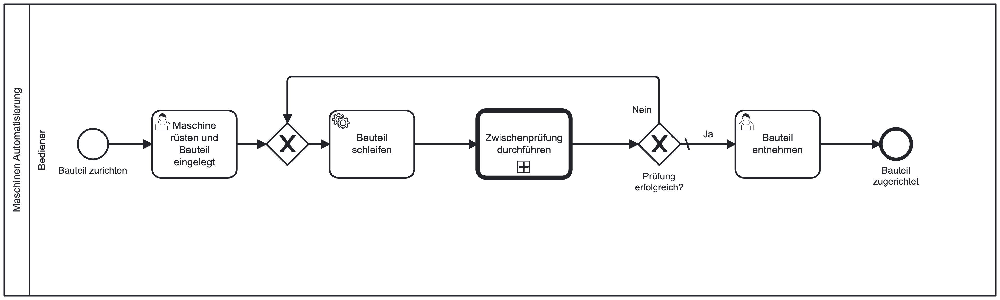
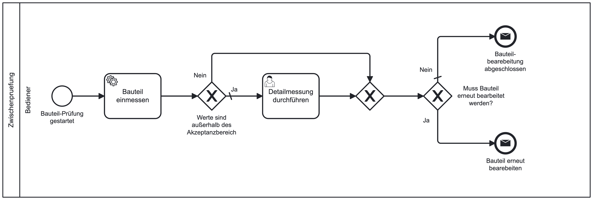
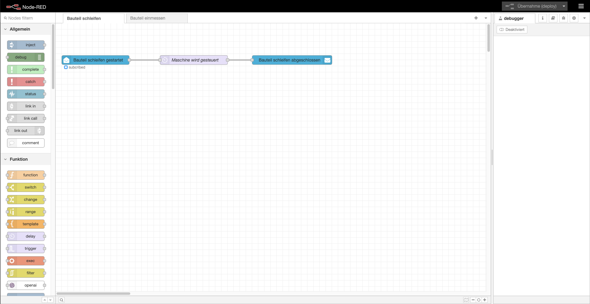
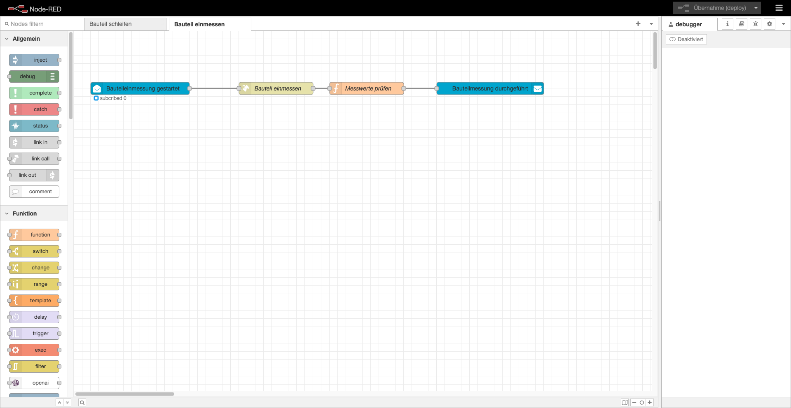

# ProcessCube® - Node-RED - HowTo - Basic Automation

Diese Projekt enthält die Grundlage für das processCube® - Node-RED - HowTo - Video.

Die `5Minds Engine` übernimmt die Automatisierung des fachlich-beschriebenen Prozess und die `Low-Code Plattform Node-RED` die technische Automatisierung.

Neben den Prozessen für die 5Minds Engine und den Flows für Node-RED, enthält das Projekt eine Docker-Compose-Datei, mit der die Umgebung des HowTos einfach aufgesetzt werden kann.

Der Ordner `processes` enthält zwei Prozesse. Der Prozess `MaschinenAutomatisierung.bpmn` enthält die Prozessbeschreibung für das Schleifen eines Bauteils.
Dieser Prozess enthält einge User-Task die Masken für die Interaktion mit dem Bediener anbieten und einen Service-Task der einen Automatisierungsschritt darstellt.



Mit der Call-Activity wird der Subprozess `Zwischenpruefung.bpmn` aufgerufen.

Der Zwischenprüfungsprozess enthält ebenfalls einen Automatisierungsschritt und eine Eingabemaske für das Auswerten der Prüfwerte.



Die Automatisierungs-Schritte sind nach dem External-Task-Handler-Pattern in den Node-RED Flows `Bauteil schleifen` und `Bauteil einmessen` modelliert.



Der `Bauteil schleifen`-Flow enthält die Knoten für das Abbonieren des External-Task-Topics und dem Rückmelden des Abschluss des Handlings.
Die Automatisierung der Maschine ist nur mit einem Delay-Knoten emuliert.



Der `Bauteil einmessen`-Flow enthält ebenfalls die Knoten für das External-Task-Handling und Automatisierungs-Schritte die das Messen des Bauteils in der Maschine und der Analyse des Ergebnisses darstellen.

## Vorraussetzungen

- Installiertes 5Minds-Studio (https://processcube.io/)
- Installierter Docker-Client oder verlgeichbares (z.B. Podman)

## Starten der Container

Im Repository ist eine `docker-compose.yml` Datei enthalten, diese kann mit Docker ausgeführt werden.

```bash
docker compose up -d
```

Anschließend ist es möglich sich mit dem 5Minds Studio mit der Engine unter `http://localhost:8000` zu verbinden und Node-RED sollte unter `http://localhost:1880` erreichbar sein.

## Prozesse ausführen

Die Prozess sind bereits in der Engine und Node-RED veröffenlicht.
Der `Maschinen Automatisierung` kann dann direkt über das Debug-Symbol gestartet werden, die User-Tasks können direkt im Studio ausgefüllt werden.
